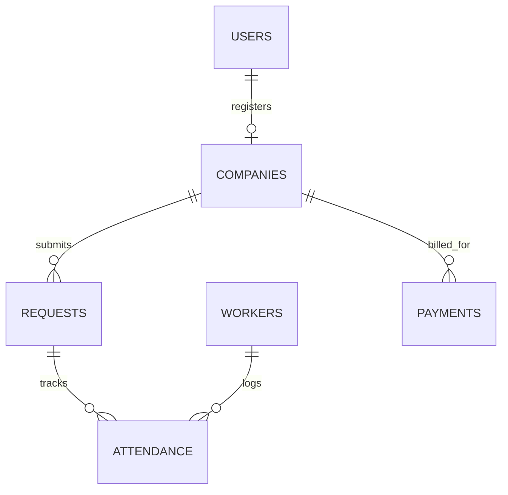

# 🗄️ Database Tier — LaborDesk

The **Database Tier** handles relational schema definitions, constraints, index optimizations, and seed scripts for PostgreSQL and Supabase.

---

## 📁 File Structure

| File | Description |
| :--- | :--- |
| **`schema.sql`** | Production PostgreSQL schema (tables, foreign keys, ENUM checks, UUID triggers, indexes). |
| **`seed.sql`** | Initial mock dataset seed for workers, companies, and active requests. |
| **`db.ts`** | TypeScript database client connector & memory persistence fallback. |

---

## 📊 Relational ERD Schema



---

## 🛠️ PostgreSQL Setup & Migration

To set up a local PostgreSQL or Supabase instance:

```bash
# Run PostgreSQL container
docker run --name labordesk-db -e POSTGRES_PASSWORD=postgres -p 5432:5432 -d postgres:16-alpine

# Import schema and seed scripts
psql -h localhost -U postgres -d labordesk -f database/schema.sql
psql -h localhost -U postgres -d labordesk -f database/seed.sql
```
